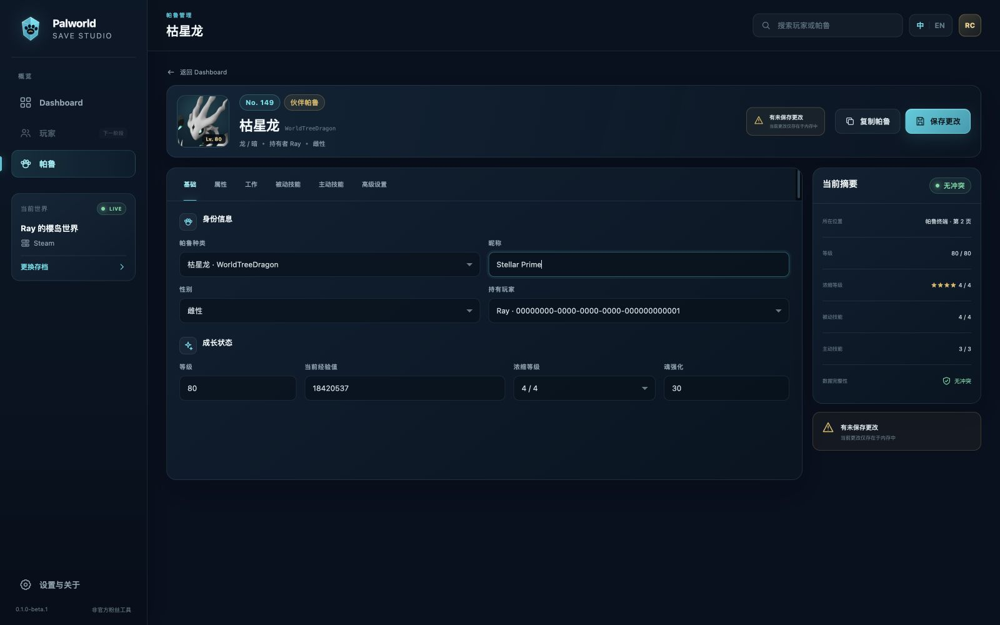

# Palworld Save Studio

Palworld Save Studio is a modern Windows save editor for Palworld 1.0. The
first public build targets Windows 10/11 x64 and supports Steam and dedicated
server saves.

[Download the latest release](https://github.com/RayChen200318/palworld-save-studio/releases/latest)

> Current status: `0.1.0-beta.1` interface prototype. The save engine and
> Palworld 1.0 data baseline are present, but this new interface is not yet a
> production release. Always edit a copy of your save.

## Interface preview




## Preview scope

The current visual-approval build contains three interactive mock-data screens:

- save detection and opening;
- dashboard;
- Pal detail editor.

The remaining editors will be connected after this design direction is
approved. Xbox/Game Pass, installers, automatic updates, cloud sync, telemetry,
batch editing, multi-level undo, light theme, and non-Windows platforms are not
part of the first release.

## Development

Requirements: Python 3.11+, Node.js 20+, and Windows for the packaged GUI.

```powershell
cd frontend
corepack pnpm install --frozen-lockfile
corepack pnpm dev
```

The complete Windows build is produced by:

```powershell
.\build_executable.ps1
```

The output is `dist\Palworld-Save-Studio.exe`. Configuration and logs are kept
under `%LOCALAPPDATA%\PalworldSaveStudio`, and save backups are written into a
`Palworld-Save-Studio-Backup` directory beside the target save.

## License and provenance

This project is licensed under GPL-3.0. It reuses GPL-licensed save parsing and
editing work from upstream projects; see [NOTICE](NOTICE) for source attribution
and the import baseline. Palworld Save Studio is an unofficial fan tool and is
provided without warranty.
